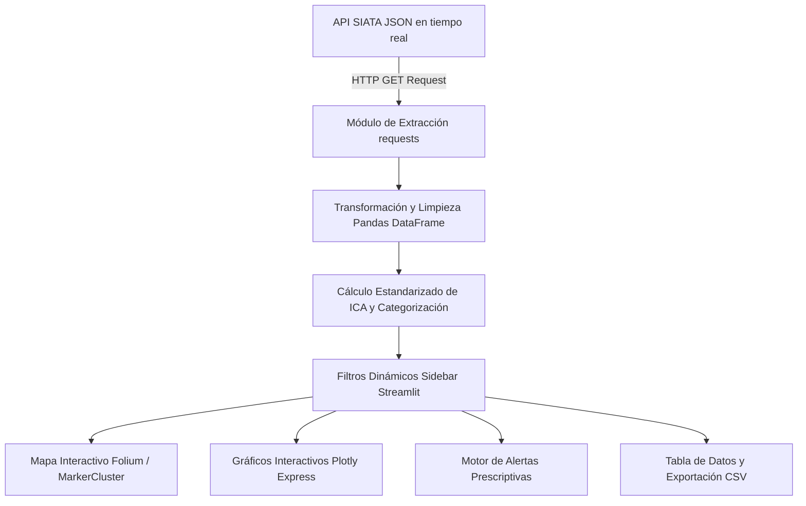

# 🍃 Sistema de Monitoreo de Calidad del Aire (PM2.5) - Valle de Aburrá (SIATA)


Aplicación web interactiva desarrollada en **Streamlit** para el monitoreo en tiempo real, visualización geográfica, análisis exploratorio y sistema prescriptivo de alertas tempranas del material particulado **PM2.5** en el Valle de Aburrá. La herramienta consume directamente la API oficial del **SIATA** (*Sistema de Alerta Temprana de Medellín y el Valle de Aburrá*).

---

## 📌 Tabla de Contenidos
- [🎯 Problema y Contexto](#-problema-y-contexto)
- [✨ Características Principales](#-características-principales)
- [🔬 Marco Teórico y Cálculo del ICA](#-marco-teórico-y-cálculo-del-ica)
- [⚙️ Arquitectura del Sistema y Flujo de Datos](#️-arquitectura-del-sistema-y-flujo-de-datos)
- [📄 Estructura del Repositorio](#-estructura-del-repositorio)
- [🛠️ Instalación y Ejecución Local](#️-instalación-y-ejecución-local)
- [☁️ Guía de Despliegue en Streamlit Cloud](#️-guía-de-despliegue-en-streamlit-cloud)
- [📡 Integración con la API SIATA](#-integración-con-la-api-siata)

---

## 🎯 Problema y Contexto

La Secretaría de Salud Municipal de Medellín y las autoridades ambientales del Valle de Aburrá requieren un sistema de apoyo a la decisión para:
1. **Monitorear** continuamente las estaciones de medición de PM2.5.
2. **Identificar zonas críticas** de contaminación del aire.
3. **Emitir recomendaciones prescriptivas** automáticas a poblaciones vulnerables (niños, adultos mayores, pacientes con afecciones respiratorias o cardiovasculares).
4. **Facilitar la toma de decisiones** en salud pública y movilidad urbana.

---

## ✨ Características Principales

- 🗺️ **Mapa Interactivo (Folium):** Renderizado de las estaciones georreferenciadas con clústeres dinámicos, códigos de color según categoría ICA y tooltips descriptivos.
- 📊 **Análisis Estadístico Exploratorio (Plotly):** Visualización interactiva con histogramas de distribución, diagramas de caja (boxplots), gráfico de barras por categoría y top 10 de estaciones más contaminadas.
- 🚨 **Sistema Prescriptivo de Alertas Tempranas:** Clasificación automática de riesgos (Alertas Roja, Naranja, Amarilla y Verde) acompañadas de recomendaciones de salud en tiempo real.
- 🔍 **Filtros Avanzados y Tabla de Datos:** Filtrado por municipio/ciudad y categoría ICA, búsqueda de estaciones por texto y descarga de datasets procesados en formato `.csv`.
- ⚡ **Optimización con Caché (`st.cache_data`):** Reducción de latencia y llamadas innecesarias a la API mediante almacenamiento temporal con TTL de 300 segundos.

---

## 🔬 Marco Teórico y Cálculo del ICA

### ¿Qué es el PM2.5?
El **PM2.5** corresponde a partículas finas suspendidas en el aire con un diámetro menor o igual a 2.5 micrómetros. Debido a su tamaño reducido, ingresan profundamente en el sistema respiratorio y pueden pasar al torrente sanguíneo. Sus principales fuentes son la combustión vehicular (motores diésel y gasolina), emisiones industriales y quemas.

### Cálculo del Índice de Calidad del Aire (ICA)
El cálculo del ICA en la aplicación utiliza las ecuaciones de interpolación lineal estandarizadas por la EPA y el SIATA a partir de la concentración de PM2.5 en $\mu g/m^3$:

$$ICA = \frac{I_{high} - I_{low}}{C_{high} - C_{low}} \times (C - C_{low}) + I_{low}$$

### Tabla de Categorización ICA

| Rango PM2.5 ($\mu g/m^3$) | Rango ICA | Categoría | Color | Impacto en Salud y Recomendación |
|---|---|---|---|---|
| **0.0 - 12.0** | 0 - 50 | **Buena** | 🟢 Verde | Calidad satisfactoria. Actividades normales al aire libre. |
| **12.1 - 35.4** | 51 - 100 | **Aceptable** | 🟡 Amarillo | Calidad aceptable. Personas muy sensibles deben considerar reducir esfuerzo prolongado. |
| **35.5 - 55.4** | 101 - 150 | **Moderada** | 🟠 Naranja | Grupos sensibles (niños, ancianos, asmáticos) deben evitar ejercicio intenso al aire libre. |
| **55.5 - 150.4** | 151 - 200 | **Mala** | 🔴 Rojo | Usar mascarilla. La población general debe limitar la exposición al aire libre. |
| **150.5 - 250.4** | 201 - 300 | **Muy Mala** | 🟣 Morado | Permanecer en interiores con ventanas cerradas. Activar alertas institucionales. |
| **> 250.4** | > 300 | **Peligrosa** | 🟤 Marrón | Emergencia sanitaria. Evitar cualquier tipo de exposición al aire libre. |

---

## ⚙️ Arquitectura del Sistema y Flujo de Datos



---

## 📄 Estructura del Repositorio

```text
Parcial1ML/
│
├── app.py                      # Aplicación principal interactiva en Streamlit
├── requirements.txt            # Dependencias del proyecto (pandas, plotly, folium, etc.)
├── README.md                   # Documentación detallada del proyecto
├── Parcial1.ipynb              # Cuaderno Jupyter con el flujo original de análisis de datos
├── landing_page_siata.html     # Landing page explicativa del sistema
└── venv/                       # Entorno virtual de Python (ignorado en git)
```

---

## 🛠️ Instalación y Ejecución Local

### 1. Clonar el repositorio
```bash
git clone https://github.com/TU_USUARIO/Parcial1ML.git
cd Parcial1ML
```

### 2. Crear y activar el entorno virtual
En **Windows**:
```powershell
python -m venv venv
.\venv\Scripts\activate
```

En **Linux / macOS**:
```bash
python3 -m venv venv
source venv/bin/activate
```

### 3. Instalar las dependencias
```bash
pip install -r requirements.txt
```

### 4. Ejecutar la aplicación de Streamlit
```bash
streamlit run app.py
```

La aplicación estará disponible localmente en `http://localhost:8501`.

---

## ☁️ Guía de Despliegue en Streamlit Cloud

Para desplegar esta aplicación públicamente de manera gratuita:

1. Asegúrate de tener los cambios guardados y subidos a un repositorio en **GitHub**.
2. Ingresa a **[share.streamlit.io](https://share.streamlit.io/)** e inicia sesión con tu cuenta de GitHub.
3. Haz clic en el botón **"New app"**.
4. Completa la configuración de despliegue:
   - **Repository:** `TU_USUARIO/Parcial1ML`
   - **Branch:** `main` (o `master`)
   - **Main file path:** `app.py`
5. Haz clic en **"Deploy!"**. Streamlit Cloud instalará automáticamente los paquetes de `requirements.txt` y desplegará la app.
6. Resultado: Página desplegada en streamlit.io: https://parcial1-machine-learning-esx6eg8sf4hhjomcfh3hc2.streamlit.app

---

## 📡 Integración con la API SIATA

La aplicación se conecta con la siguiente API pública oficial de SIATA:
- **Endpoint:** `https://siata.gov.co/EntregaData1/Datos_SIATA_Aire_AQ_pm25_Last.json`
- **Formato:** `JSON`
- **Parámetro monitoreado:** Concentración de PM2.5 ($\mu g/m^3$) de la red de estaciones automáticas del Valle de Aburrá.
